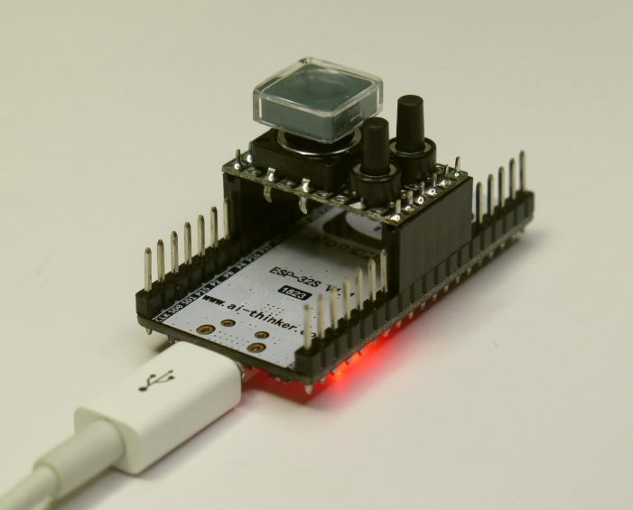
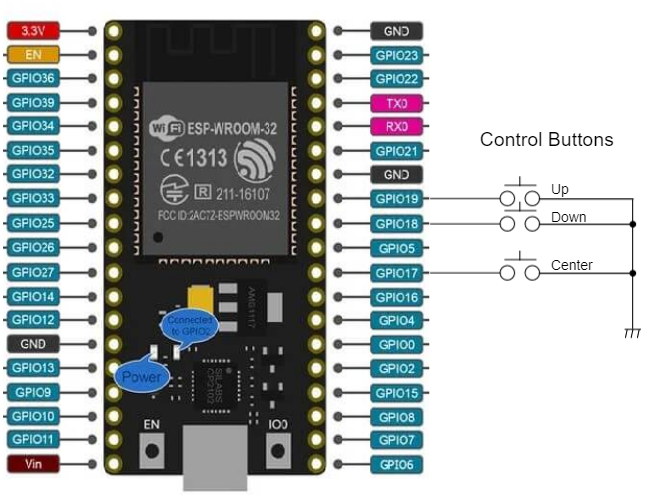
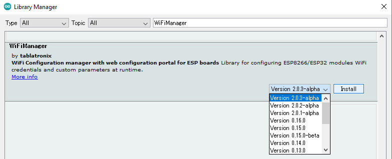
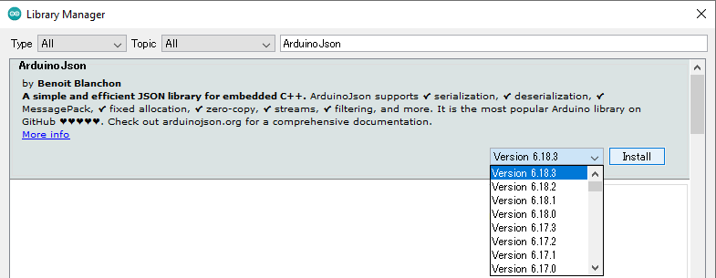
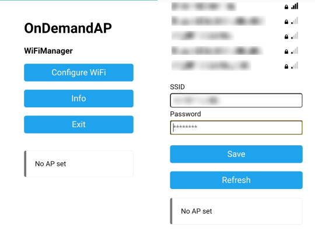
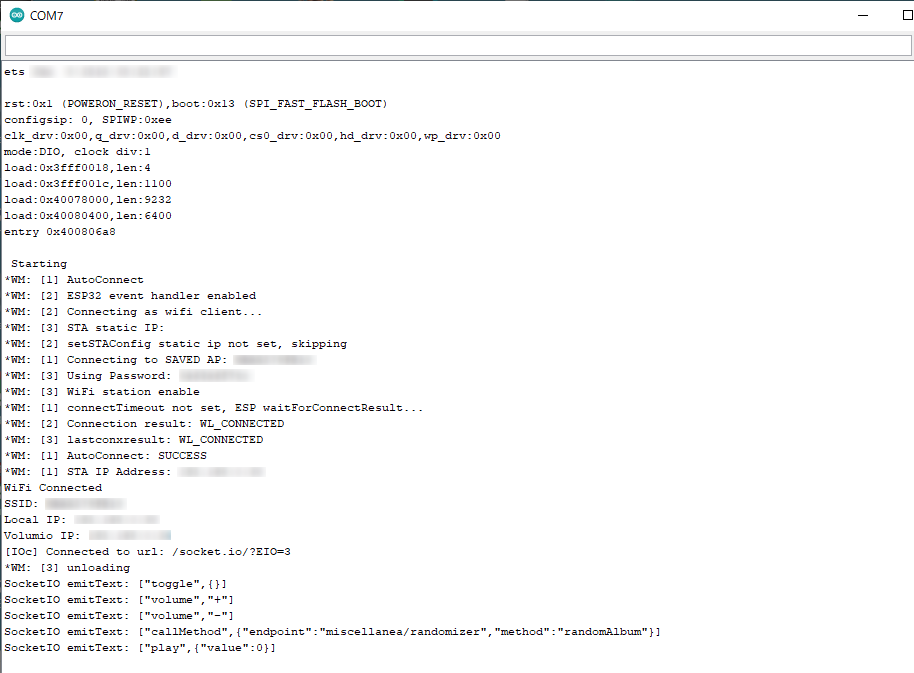

# Volumio Simple Control Buttons


## Overview
This project is for controlling Volumio by simple control buttons on ESP32 module.

This project offers to control:
* Toggle (Play/Pause)
* Volume Up/Down
* Random Album Play (based on Randomizer plugin)

## Supported Board
* NodeMCU ESP32 (ESP32-DevkitC)

## Pin Assignment

| ESP32 Pin | GPIO Function | Assignment |
----|----|----
| GPIO2 | OUTPUT | Blue LED |
| GPIO17 | INPUT/PULLUP | Center Button |
| GPIO18 | INPUT/PULLUP | Down Button |
| GPIO19 | INPUT/PULLUP | Up Button |



## Quick Start
### Installing Libraries to Arduino
#### WiFiManager
Arduino -> 'Tools' -> 'Manage Libraries...' -> Install 'WiFiManager' Version 2.0.3-alpha or later<br />


#### ArduinoJson
Arduino -> 'Tools' -> 'Manage Libraries...' -> Install 'ArduinoJson' Version 6.18.3 or later<br />


#### arduinoWebSockets
Download [arduinoWebSockets-2.3.4.zip](https://github.com/Links2004/arduinoWebSockets/archive/refs/tags/2.3.4.zip)<br />
Arduino -> 'Sketch' -> 'Include Library' -> Add .ZIP Library -> Select 'arduinoWebSockets-2.3.4.zip' downloaded above.<br />
Note that arduinoWebSockets-2.3.5 causes build error.

### Configuration for your enviroment
If Volumio hostname is other than 'volumio', revise following line in VolumioSimpleControlButtons.ino.
```
const char *VolumioHost = "volumio"; // Change here
```

### Build
Arduino -> 'Tools' -> 'Board' -> 'ESP32 Arduino' -> 'ESP32 Dev Module' <br />
Arduino -> 'Sketch' -> 'Upload'

### SSID Setup (by WiFiManager)
* Connect SSID 'OnDemandAP' when ESP32 power on at first time to set up WiFi connection. <br /> See detail at [WiFiManger](https://github.com/tzapu/WiFiManager).
* Reset SSID configuration when ESP32 Reset button released with pushing Center button, Up button and Down button.



## Button Control Guide
* Center button single click to toggle (play/pause)
* Center button 3 times click to random album play
* Up button single/continuous click to increase volume
* Down button single/continuous click to decrease volume

## Serial Log Example


